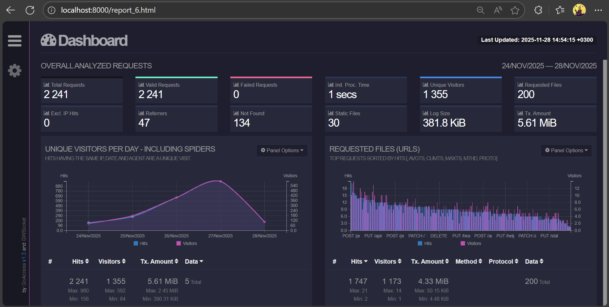
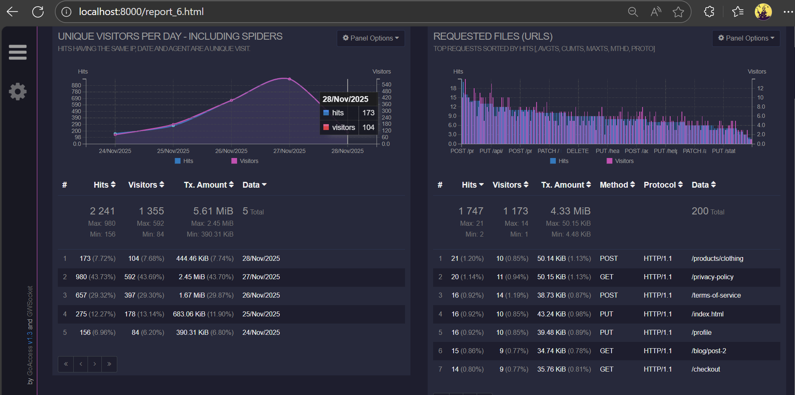
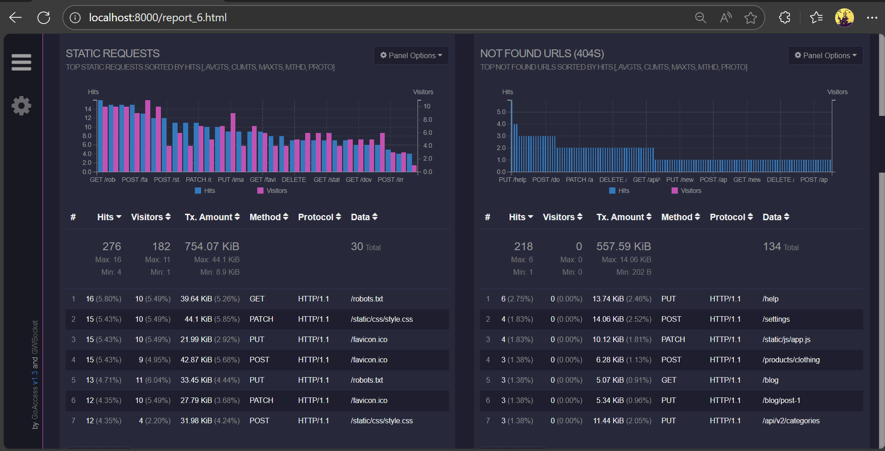
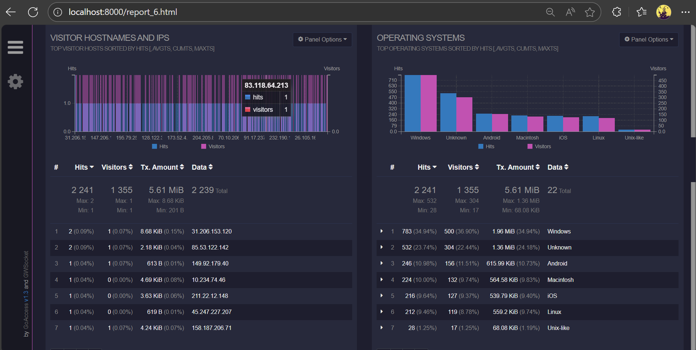
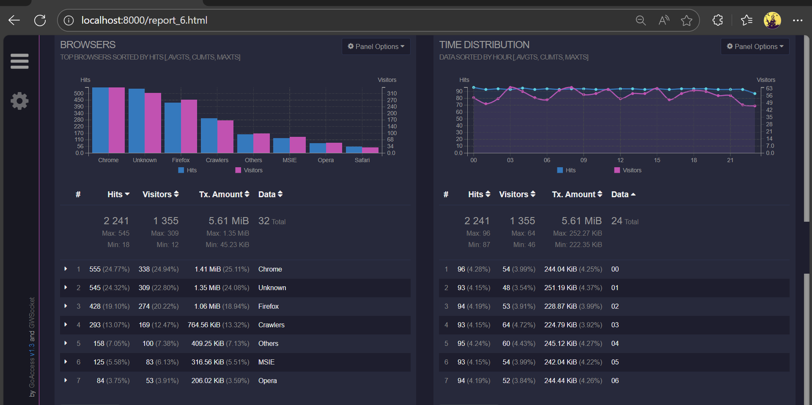

# Part 6. **GoAccess**

С помощью утилиты GoAccess получим ту же информацию, что и в части 5

Установим утилиту GoAccess: `sudo apt install goaccess`  
Используя логи из задания 4 сгенерируем отчет командой: `goaccess "$LOG_DIR"/*.log -o "$REPORT_FILE" --log-format=COMBINED`  
Запустим веб-сервер для просмотра отчета с локальной машины по адресу: `http://localhost:8000`  

### Вывод отчета
  
  
  
  

