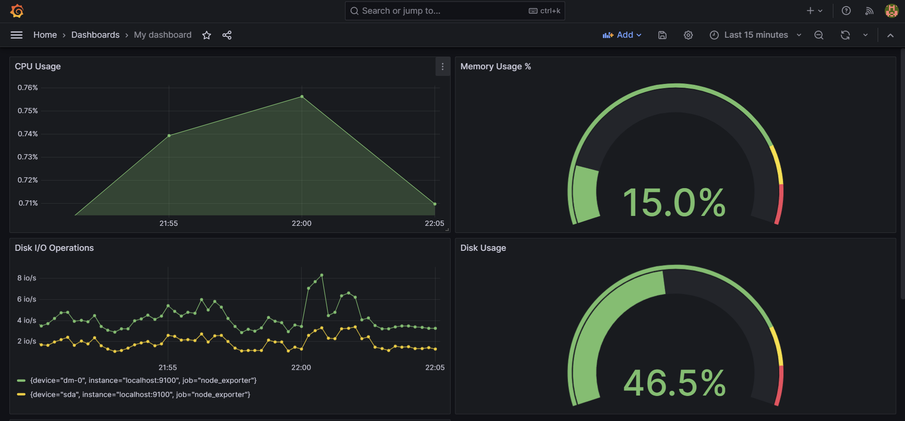
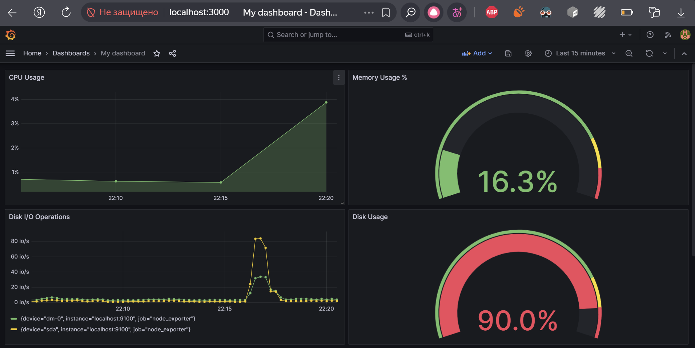
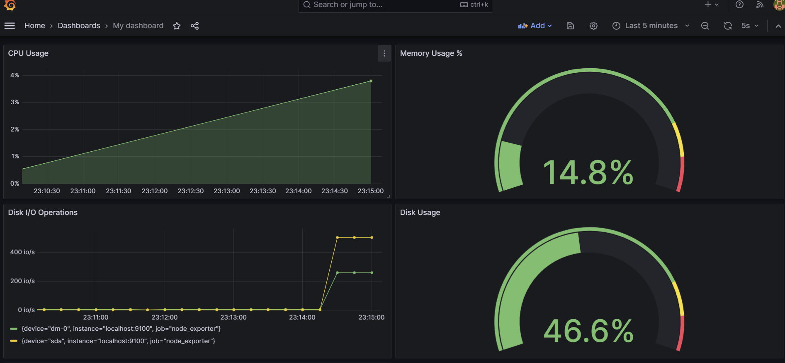

# Part 7. **Prometheus** и **Grafana**

## Установка и настройка **Prometheus** и **Grafana** на виртуальной машине.

`sudo apt update && sudo apt upgrade -y`  

Сначала подготовим "среду обитания" для ПО, т.к. это безопаснее, чем запускать от root и потом менять владельца
### Cоздаем пользователя
`sudo useradd --no-create-home --shell /bin/false prometheus`  
`sudo useradd --no-create-home --shell /bin/false node_exporter`  

### Создаем директории
`sudo mkdir /etc/prometheus`  
`sudo mkdir /var/lib/prometheus`  

### Скачиваем Prometheus
`wget https://github.com/prometheus/prometheus/releases/download/v2.47.0/prometheus-2.47.0.linux-amd64.tar.gz`  
`tar xvf prometheus-2.47.0.linux-amd64.tar.gz`  
`cd prometheus-2.47.0.linux-amd64/`  

### Копируем файлы
`sudo cp prometheus promtool /usr/local/bin/`  
`sudo cp -r consoles/ console_libraries/ /etc/prometheus/`  

### Настраиваем права
`sudo chown prometheus:prometheus /usr/local/bin/prometheus`  
`sudo chown prometheus:prometheus /usr/local/bin/promtool`  
`sudo chown -R prometheus:prometheus /etc/prometheus`  
`sudo chown prometheus:prometheus /var/lib/prometheus`  

### Создаем конфигурационный файл
`sudo vim /etc/prometheus/prometheus.yml`  
#### Содержимое:
```yaml
global:
  scrape_interval: 5s

scrape_configs:
  - job_name: 'prometheus'
    static_configs:
      - targets: ['localhost:9090']

  - job_name: 'node_exporter'
    static_configs:
      - targets: ['localhost:9100']
```
### Создаем systemd службу для Prometheus
`sudo vim /etc/systemd/system/prometheus.service`  

#### Содержимое:
```service
[Unit]
Description=Prometheus
Wants=network-online.target
After=network-online.target

[Service]
User=prometheus
Group=prometheus
Type=simple
ExecStart=/usr/local/bin/prometheus 
    --config.file /etc/prometheus/prometheus.yml 
    --storage.tsdb.path /var/lib/prometheus/ 
    --web.console.templates=/etc/prometheus/consoles 
    --web.console.libraries=/etc/prometheus/console_libraries

[Install]
WantedBy=multi-user.target
```

## Установка **Node Exporter**
`wget https://github.com/prometheus/node_exporter/releases/download/v1.6.1/node_exporter-1.6.1.linux-amd64.tar.gz`  
`tar xvf node_exporter-1.6.1.linux-amd64.tar.gz`  
`cd node_exporter-1.6.1.linux-amd64/`  
`sudo cp node_exporter /usr/local/bin/`  
`sudo chown node_exporter:node_exporter /usr/local/bin/node_exporter`  

### Создаем службу для Node Exporter
`sudo vim /etc/systemd/system/node_exporter.service`  

#### Содержимое:
```service
[Unit]
Description=Node Exporter
Wants=network-online.target
After=network-online.target

[Service]
User=node_exporter
Group=node_exporter
Type=simple
ExecStart=/usr/local/bin/node_exporter

[Install]
WantedBy=multi-user.target
```
## Запускаем службы
### Перезагружаем systemd
`sudo systemctl daemon-reload`  

### Включаем и запускаем службы
`sudo systemctl enable prometheus`  
`sudo systemctl start prometheus`  
`sudo systemctl enable node_exporter`  
`sudo systemctl start node_exporter`  

### Проверяем статус
`sudo systemctl status prometheus`  
`sudo systemctl status node_exporter`  

## Установка **Grafana**
`sudo apt-get install -y apt-transport-https`  
`sudo apt-get install -y software-properties-common wget`  
`wget -4 https://dl.grafana.com/oss/release/grafana_10.2.2_amd64.deb`  
`sudo apt install ./grafana_10.2.2_amd64.deb`  

### Запускаем Grafana
`sudo systemctl enable grafana-server`  
`sudo systemctl start grafana-server`  
`sudo systemctl status grafana-server`  

### Разрешаем порты
`sudo ufw allow 9090/tcp`    
`sudo ufw allow 9100/tcp`    
`sudo ufw allow 3000/tcp`    

## Получаем доступ к веб-интерфейсам **Prometheus** и **Grafana** с локальной машины.
Prometheus: `http://localhost:9090`

Node_exporter: `http://localhost:9100/metrics`

Grafana: `http://localhost:3000`

Логин в Grafana: admin/admin (меняем при первом входе)

В Grafana добавляем источник данных:
Type: Prometheus
URL: `http://localhost:9090`

## Добавляем на дашборд **Grafana** отображение ЦПУ, доступной оперативной памяти, свободное место и кол-во операций ввода/вывода на жестком диске.

**CPU использование:** 
Querty: `(1 - sum(rate(node_cpu_seconds_total{mode="idle"}[5m])) / sum(rate(node_cpu_seconds_total[5m]))) * 100`  

**Оперативная память:**
Querty: `node_memory_MemAvailable_bytes / node_memory_MemTotal_bytes * 100`  

**Свободное место на диске:**
Querty: `(1 - (node_filesystem_avail_bytes{mountpoint="/"} / node_filesystem_size_bytes{mountpoint="/"})) * 100`  

**Операции ввода/вывода:**
Querty A: `rate(node_disk_writes_completed_total{device!~"sr.*", job="node_exporter"}[1m])`    
Querty B:`rate(node_disk_reads_completed_total{device!~"sr.*", job="node_exporter"}[1m])`  



## Запускаем bash-скрипт из Части 2 и смотрим на нагрузку жесткого диска (место на диске и операции чтения/записи).



## Устанавливаем утилиту **stress** и запускаем команду `stress -c 2 -i 1 -m 1 --vm-bytes 32M -t 10s`  
### Cмотрим на нагрузку жесткого диска, оперативной памяти и ЦПУ

