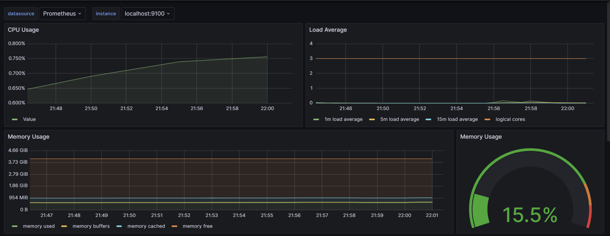
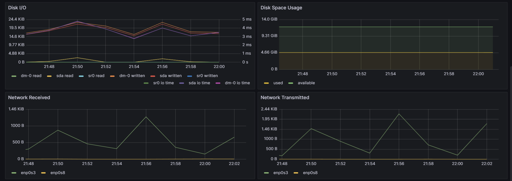
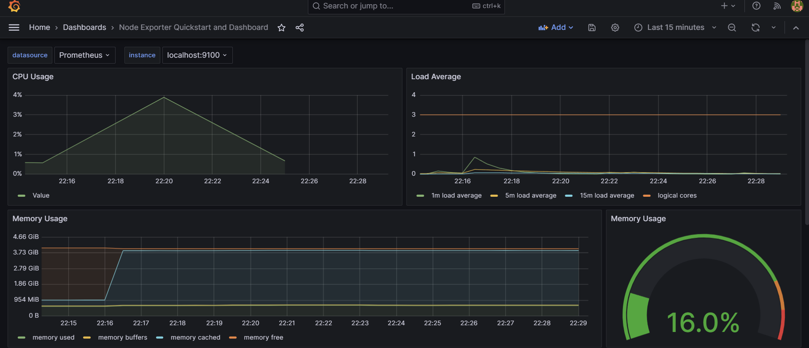
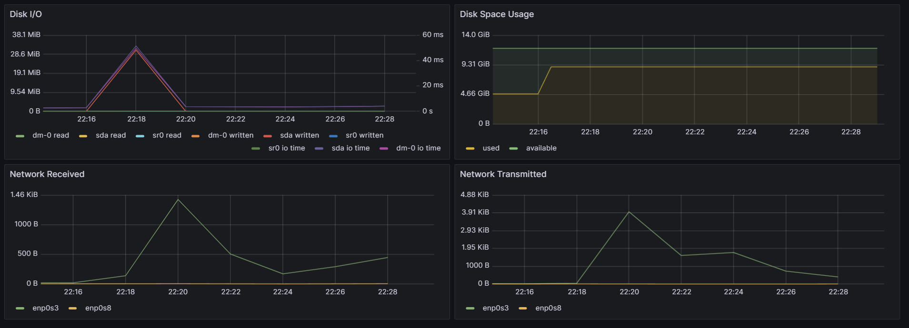
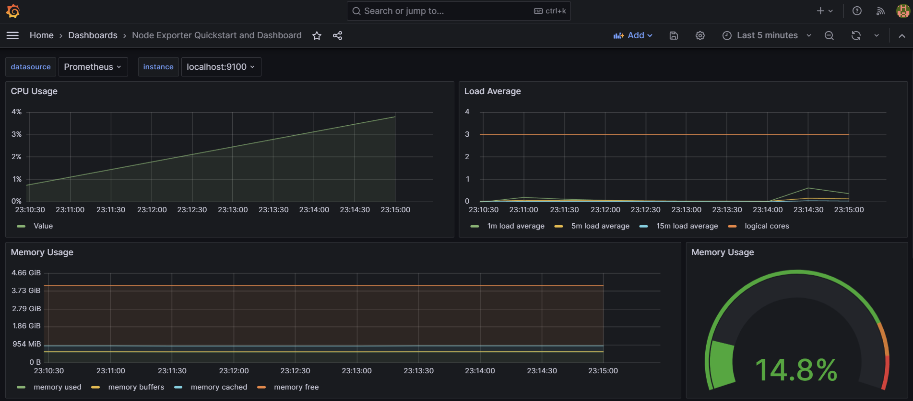
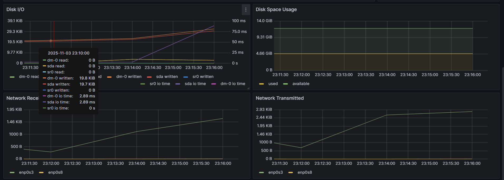
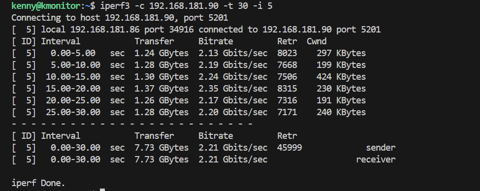
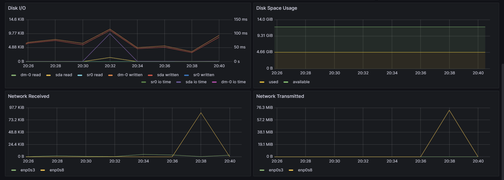

# Part 8. Готовый дашборд
## Устанавливаем готовый дашборд *Node Exporter Quickstart and Dashboard* с официального сайта **Grafana Labs**.

## Проводим те же тесты, что и в части 7
### Запускаем скрипт из части 2:

### Запускаем команду `stress -c 2 -i 1 -m 1 --vm-bytes 32M -t 10s`

## Запускаем ещё одну виртуальную машину, находящуюся в одной сети с текущей. Запускаем тест нагрузки сети с помощью утилиты **iperf3**.

### На второй машине (192.168.181.90) запускаем сервер:
`iperf3 -s`

### На первой машине (192.168.181.85) запускаем клиент:**
`iperf3 -c 192.168.181.90 -t 30 -i 5`

### Смотрим на нагрузку сетевого интерфейса.

