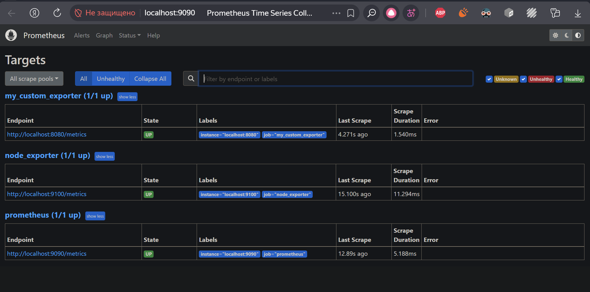
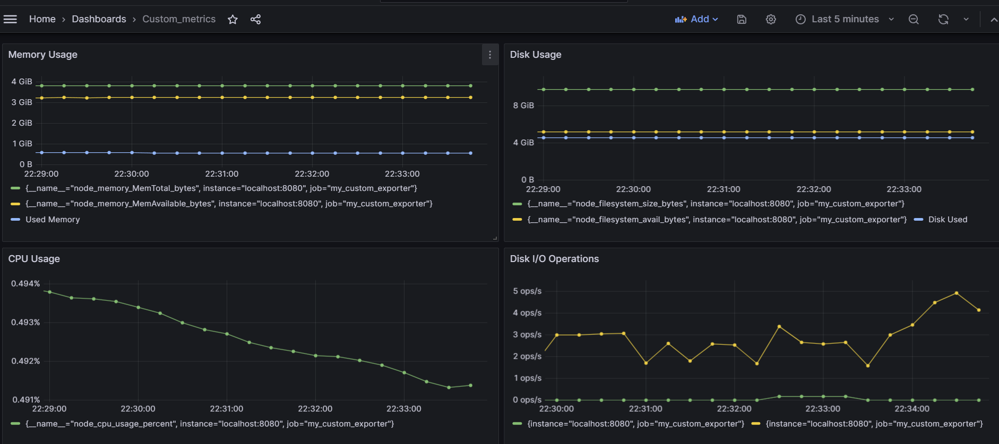
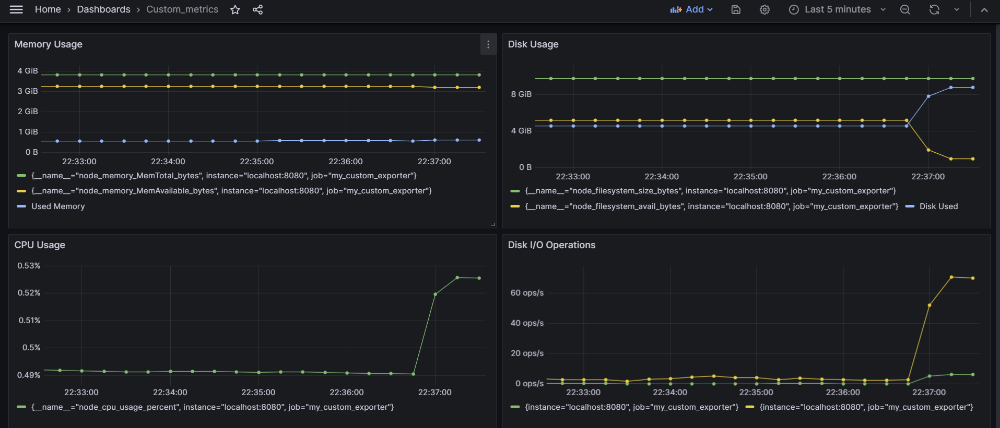
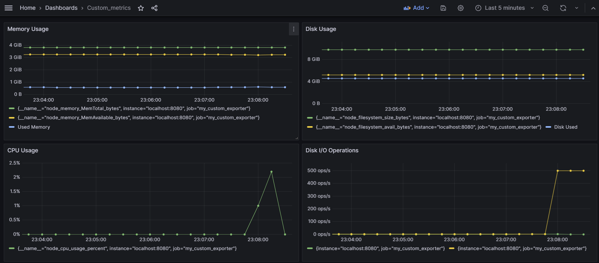

# Part 9. Дополнительно. Свой *node_exporter*

### Создаём конфигурацию nginx для отдачи метрик prometheus и активируем её

`sudo vim /etc/nginx/sites-available/my_exporter`  
```conf
server {
    listen 8080;
    server_name _;
    location /metrics/ {
        root /var/www/my_exporter/;
        index index.html;
        add_header Cache-Control "no-cache, no-store, must-revalidate";
    }
}
```
`sudo ln -s /etc/nginx/sites-available/my_exporter /etc/nginx/sites-enabled/`  
`sudo nginx -t`  
`sudo systemctl reload nginx`  

### Добавляем в prometheus.yml еще один job

```yml
  - job_name: 'my_custom_exporter'
    static_configs:
      - targets: ['localhost:8080']
    metrics_path: /metrics/
```

### Проверяем правильность синтаксиса

`sudo promtool check config /etc/prometheus/prometheus.yml`  
`sudo systemctl restart prometheus`  
`sudo systemctl status prometheus`  

### Создаём директорию, с которой nginx получает метрики и передает в prometheus

`sudo mkdir -p /var/www/my_exporter`

### Даем права на запись и чтение

`sudo chown $USER:$USER /var/www/my_exporter`  
`sudo chmod 755 /var/www/my_exporter`  

### Проверим, что сервер работает  

`curl http://localhost:8080/metrics/`

### Запускаем скрипт в фоновом режиме 
`./metrics.sh &`



### Дашборд с метриками



### Проводим те же тесты, что и в части 7

#### Запускаем скрипт из части 2


#### Запускаем команду `stress -c 2 -i 1 -m 1 --vm-bytes 32M -t 10s`


### Остановка скрипта
`pkill -f metrics.sh`